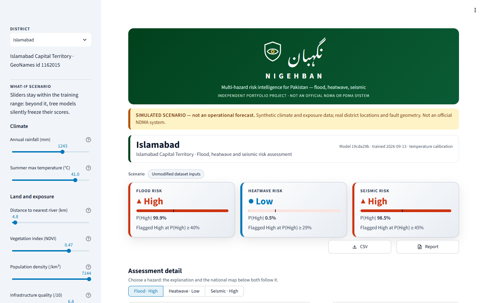
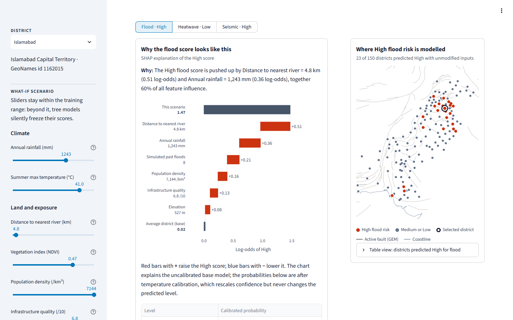
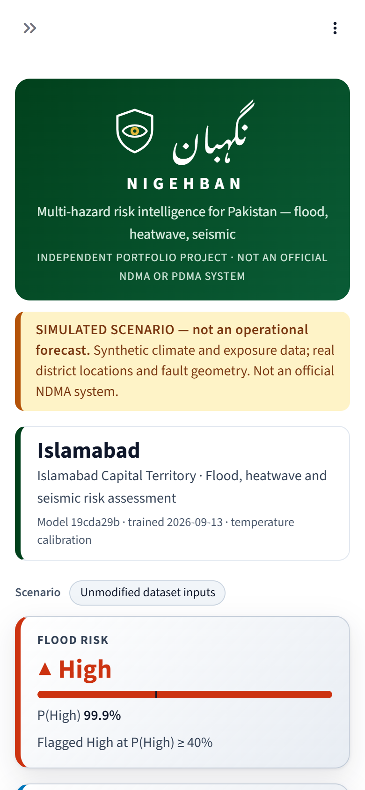
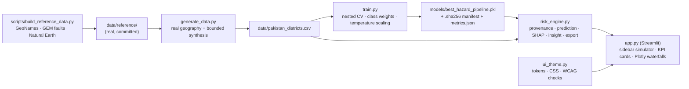

# Nigehban · نگہبان — Pakistan Multi-Hazard Risk Analyzer

**Explainable flood, heatwave, and seismic risk scoring for 150 Pakistani districts: a portfolio demonstrator built on real geography and synthetic climate data.** *Nigehban* means "guardian" or "watchman" in Urdu.

**Live demo:** not deployed yet. The repository is ready for Streamlit Community Cloud; see [Deploying](#deploying-streamlit-community-cloud). This line will carry the link once the deployment resolves.

<!-- CI badge: add after the repository is pushed to GitHub, replacing OWNER/REPO:
[](https://github.com/OWNER/REPO/actions/workflows/ci.yml) -->
[](https://www.python.org/)
[](https://streamlit.io/)
[](LICENSE)

> **SIMULATED SCENARIO — not an operational forecast.** District locations, elevation, and fault geometry are real. Climate, exposure, event counts, and every risk label are synthetic. Nothing here should inform real disaster response.

This is version 2. Version 1 was audited and rebuilt; every change is traced to a finding in [AUDIT.md](AUDIT.md), and the v1 files are preserved in [archive/v1/](archive/v1/).

---



<table>
<tr>
<td width="62%"></td>
<td width="38%"></td>
</tr>
</table>

## What it does

- Scores Low / Medium / High risk for three hazards per district, with **calibrated probabilities**, shown as KPI tiles with a P(High) meter.
- Explains every score with SHAP, as an interactive waterfall per hazard plus a one-sentence insight derived from the top two SHAP values.
- A single hazard selector drives both the explanation and a **national map** of where that hazard is predicted High, drawn over the real active-fault and coastline layers.
- Lets a user change six climate and exposure inputs in a **what-if simulator** whose sliders cannot leave the range the model was trained on, and flags input combinations unlike any real district. Changed inputs appear as chips, and each KPI tile shows the change against unmodified inputs.
- A **district profile** compares the scenario with the district's data, its province median, and the national range, marking each input as real or synthetic.
- Exports the on-screen assessment as CSV or a plain-text report.
- Checks at start-up that the model file is untampered (SHA-256), was trained on the dataset being shown, and matches the training library versions, and shows the result as a pass/fail checklist.

## What is real and what is synthetic

| Real (see [data/reference/SOURCES.md](data/reference/SOURCES.md)) | Synthetic (see [data/DATA_DICTIONARY.md](data/DATA_DICTIONARY.md)) |
|---|---|
| 150 district names, provinces, and representative coordinates (GeoNames) | Annual rainfall, June mean maximum temperature, NDVI |
| Elevation at each district point (GeoNames DEM) | Distance to river, population density, infrastructure quality |
| Distance to the nearest active crustal fault (GEM Global Active Faults Database) | Simulated flood and earthquake event counts (not historical records) |
| Distance to the Makran subduction zone (GEM / Bird 2003) | Soil type (random negative control) |
| Distance to the coast (Natural Earth) and to cities of 1M+ people (GeoNames) | All three risk labels |

Synthetic features are generated with physical structure (lapse-rate temperature, monsoon gradient, fault-distance decay) and validated against physical bounds, but they are **not observations**.

---

## Model performance (honest numbers)

Evaluation is **nested cross-validation**: an inner loop (3 folds, 20 Optuna trials) chooses between class-weighted RandomForest and CatBoost and tunes it; an outer loop (5 folds) that never took part in any choice scores the result. Values are mean ± standard deviation over the outer folds. Source: [models/metrics.json](models/metrics.json).

### Each hazard model sees only its own inputs

Earlier versions trained all three models on the same 16 columns, so moving the temperature slider changed the *seismic* score (Islamabad: P(High) 0.943 → 0.665). Each model now receives only inputs with a physical mechanism for that hazard; the justification for every input is written next to it in [train.py](train.py) (`HAZARD_FEATURES`):

| Hazard | Inputs |
|---|---|
| Flood | rainfall, distance to river, elevation, simulated past floods, population density, infrastructure quality |
| Heatwave | summer max temperature, vegetation (NDVI), elevation, distance to coast, population density, infrastructure quality |
| Seismic | distance to active fault, distance to Makran subduction zone, simulated past earthquakes, infrastructure quality |

**Check it yourself in the demo:** note the Seismic card, then drag *Summer max temperature* or *Annual rainfall* to either end. The Seismic card must show **■ +0.0 pts**; Heatwave (temperature) or Flood (rainfall) will move. `tests/test_risk_engine.py::test_moving_unrelated_sliders_leaves_seismic_unchanged` enforces this. Isolation did not cost accuracy: argmax macro-F1 went 0.738 → 0.757 (flood), 0.739 → 0.730 (heatwave), 0.806 → 0.825 (seismic).

### Headline metrics

| Hazard | Deployed model | High flagged at P(High) ≥ | Macro-F1 (argmax → recall-tuned) | ROC-AUC (OvR) | Quadratic kappa (tuned) |
|---|---|---|---|---|---|
| Flood | CatBoost | 40% | 0.757 ± 0.085 → 0.692 ± 0.051 | 0.929 | 0.780 |
| Heatwave | RandomForest | 29% | 0.730 ± 0.079 → 0.704 ± 0.083 | 0.911 | 0.801 |
| Seismic | CatBoost | 45% | 0.825 ± 0.111 → 0.773 ± 0.106 | 0.952 | 0.840 |

With ~150 rows the standard deviations are wide; differences of a few hundredths are noise.

### Recall on High districts: the trade-off, stated

A missed High district is costlier than a false alarm, so the deployed rule flags High when the calibrated P(High) reaches a per-hazard threshold, chosen on **training folds only** to maximise F2 for High (recall weighted twice as heavily as precision; a stated judgment). The table compares the plain argmax rule with the recall-tuned rule on the **same held-out predictions**: each district is predicted once, by a model, calibration, and threshold that never saw it (pooled outer folds).

| Hazard | Rule | High precision | High recall | High F1 | Missed High (of 23) | False High alarms (of 127) |
|---|---|---|---|---|---|---|
| Flood | argmax | 0.80 | 0.70 | 0.74 | 7 | 4 (3.1%) |
| Flood | recall-tuned | 0.54 | **0.87** | 0.67 | **3** | 17 (13.4%) |
| Heatwave | argmax | 0.58 | 0.65 | 0.61 | 8 | 11 (8.7%) |
| Heatwave | recall-tuned | 0.49 | **0.91** | 0.64 | **2** | 22 (17.3%) |
| Seismic | argmax | 0.86 | 0.78 | 0.82 | 5 | 3 (2.4%) |
| Seismic | recall-tuned | 0.69 | 0.78 | 0.73 | 5 | 8 (6.3%) |

- **Flood and heatwave:** the rule catches 4 and 6 more High districts, at the cost of 13 and 11 extra false alarms. Medium recall also drops (flood 0.73 → 0.49, heatwave 0.73 → 0.51), because borderline Medium districts are now flagged High.
- **Seismic:** the rule bought **no** recall on held-out districts and added 5 false alarms. It was fixed before evaluation, so it is reported rather than quietly removed; with 23 High districts, one or two districts decide this, and more data is the real fix.
- Full per-class precision, recall, and F1 for all classes are in `models/metrics.json` (`per_class_held_out`).

### Calibration

Class weighting improves minority-class recall but distorts probabilities, so the deployed models apply **temperature scaling** (chosen in advance). It rescales confidence without changing the argmax level.

| Hazard | Brier score (raw → calibrated) | Log loss (raw → calibrated) | ECE (raw → calibrated) |
|---|---|---|---|
| Flood | 0.295 → 0.277 | 0.521 → 0.478 | 0.130 → 0.107 |
| Heatwave | 0.300 → 0.293 | 0.530 → 0.481 | 0.117 → 0.093 |
| Seismic | 0.238 → **0.268** | 0.418 → **0.441** | 0.129 → **0.167** |

Lower is better. Calibration helped flood and heatwave but made seismic **worse** on every measure; with 23 High districts per hazard, calibration is estimated from very few examples.

### Are the honest numbers lower than v1 reported? Yes, on the same data.

The v1 notebook reported macro-F1 of 0.716 / 0.665 / 0.791. Those numbers came from choosing the model family and tuning it on the same folds that were then used to score it, which rewards whichever configuration happened to fit those folds best. Re-scoring the **v1 dataset** with the v2 nested protocol ([scripts/evaluate_v1_protocol.py](scripts/evaluate_v1_protocol.py), output in [archive/v1/v1_nested_cv_metrics.json](archive/v1/v1_nested_cv_metrics.json)):

| Hazard | v1 notebook (selection-biased) | Nested CV on the same v1 data | Difference |
|---|---|---|---|
| Flood | 0.716 | 0.689 ± 0.056 | −0.027 |
| Heatwave | 0.665 | 0.482 ± 0.069 | −0.183 |
| Seismic | 0.791 | 0.748 ± 0.053 | −0.043 |

This is a correction, not a regression: the lower numbers estimate performance on districts the model has not been tuned on, which is the only number that matters for a new district.

**The v2 scores above are higher than v1's, but that is not a modelling improvement and should not be read as one.** v2 uses a different dataset: real coordinates, fault-based seismic labels, and smoother physically structured features. Its labels are easier to learn, so v1 and v2 scores are not comparable.

---

## Explainability

Each hazard shows a Plotly SHAP waterfall of the **High** score over that hazard's own inputs: the average district at the bottom, each feature's contribution, and the scenario's value at the top. Units are stated on the axis: probability points for RandomForest, log-odds for CatBoost. The chart explains the uncalibrated base model; the probabilities shown alongside it are calibrated.

CatBoost models are explained with CatBoost's native TreeSHAP implementation. During the rebuild, `shap.TreeExplainer` crashed the whole process on these models in 3 of 8 fresh runs (see AUDIT R1).

### The insight sentence

`risk_engine.narrate_explanation` does not fill blanks in a fixed sentence. At inference time it takes the two largest SHAP contributions and chooses the sentence structure from three properties of those values:

1. Is the second driver worth naming? (Its share of total |SHAP| is at least 10%.)
2. Do the two drivers push in the same direction or opposite directions?
3. Does the first driver dominate? (At least 2× the second.)

Worked examples, produced by the committed model (not written by hand):

**Quetta, heatwave, with summer temperature raised to the training maximum (47.9 °C)** — RandomForest, so values are probability; calibrated P(High) = 30.5%.

| Rank | Feature = value | SHAP | Share of total \|SHAP\| (0.506) |
|---|---|---|---|
| 1 | Summer max temperature = 47.9 °C | +0.202 | 40% |
| 2 | Elevation = 1,638 m | −0.189 | 37% |

Second share 37% ≥ 10% → name both. Signs differ → "offset" structure. Ratio 0.202 / 0.189 = 1.07 < 2 → "largely offset". Output:

> Summer max temperature = 47.9 °C raises the High heatwave score by 20.2 pts, largely offset by Elevation = 1,638 m, which lowers it by 18.9 pts.

**Qila Abdullah (Chaman fault zone), seismic, unmodified** — CatBoost, so values are log-odds; calibrated P(High) = 87.8%.

| Rank | Feature = value | SHAP | Share of total \|SHAP\| (1.786) |
|---|---|---|---|
| 1 | Infrastructure quality = 1.7 /10 | +0.814 | 46% |
| 2 | Distance to active fault = 8.8 km | +0.656 | 37% |

Same sign → "pushed up by … and …". Ratio 1.24 < 2 → no "mainly". Output:

> The High seismic score is pushed up by Infrastructure quality = 1.7 /10 (0.81 log-odds) and Distance to active fault = 8.8 km (0.66 log-odds), together 82% of all feature influence.

Before input isolation, this district's second seismic driver was *distance to nearest river*, a relationship with no physical basis. With isolated inputs, both drivers are ones a seismologist would name: building vulnerability and fault proximity.

The function is [`risk_engine.narrate_explanation`](risk_engine.py); its branches are covered by `tests/test_risk_engine.py::test_narrative_*`.

---

## What-if simulator and extrapolation guards

- Six inputs are adjustable: rainfall, summer temperature, river distance, NDVI, population density, infrastructure quality. Geography and event history are fixed properties of a district and cannot be changed.
- Each slider's range is the minimum to maximum seen in training. Tree models cannot extrapolate: in v1, rainfall of 1,490 mm and 3,000 mm gave identical predictions.
- If the combination of values is further from every real district than 95% of real districts are from each other, the app warns that the scores are low-confidence.
- KPI cards show the change in P(High) against the district's unmodified inputs. **There is no historical baseline**: the repository contains no historical event data (see Limitations).

---

## Accessibility

- Colour-blind-safe level palette with a distinct shape per level: Low `#0077BB` ●, Medium `#CC6677` ◆, High `#CC3311` ▲. Colour is never the only cue.
- Every rendered colour pair is checked against the surface actually drawn behind it (glass-card gradient composited over the locked white page) in [tests/test_accessibility.py](tests/test_accessibility.py):

| Element | Colours | Worst-case contrast | WCAG AA threshold |
|---|---|---|---|
| Header title / subtitle / eyebrow | `#FFFFFF` / `#DCE6F2` / `#BFD7ED` on navy gradient | 12.95 / 10.26 / 8.73:1 | 4.5:1 |
| Banner text | `#78350F` on `#FEF3C7` | 8.15:1 | 4.5:1 |
| Card hazard name and detail text (13–15px) | `#334155` on card | 8.80:1 | 4.5:1 |
| Level word, Low (28px bold) | `#0077BB` on card | 4.09:1 | 3:1 (large text) |
| Level word, Medium (28px bold) | `#CC6677` on card | 3.11:1 | 3:1 (large text) |
| Level word, High (28px bold) | `#CC3311` on card | 4.41:1 | 3:1 (large text) |
| P(High) meter fill vs track | `#CC3311` on `#FBE3DD` | 4.23:1 | 3:1 (graphic) |
| Waterfall labels and values (13px) | `#334155` on white | 10.35:1 | 4.5:1 |
| Map: High / other districts | `#CC3311` / `#64748B` on white | 5.19 / 4.76:1 | 3:1 (graphic) |

27 pairs are checked in total; the table lists the ones most likely to be questioned. `#CC6677` does **not** meet 4.5:1, so it is used only as 28px bold text and as a graphic. The light theme is locked in `.streamlit/config.toml` because contrast in a dark theme has not been verified.

**A limit of the specified palette, and how the UI handles it.** Checked with a colour-separation validator, Medium `#CC6677` and High `#CC3311` are only ΔE 11.8 apart for *normal* vision (the floor for telling marks apart by colour is 15). On the KPI tiles that is acceptable, because the level word and shape are always printed. On the map, where dots sit side by side, it is not, so the map uses emphasis encoding instead: High in `#CC3311`, every other district in slate `#64748B` (ΔE 22.5 normal vision, 16.2 under colour-blindness simulation), with a legend and a table view.

**Responsive layout, what was actually tested:** [scripts/check_layout.py](scripts/check_layout.py) rendered the app in Microsoft Edge (headless, via Playwright) at 360×740, 390×844, 768×1024, and 1440×900. It measured no horizontal overflow at any width, KPI cards stacked in one column on both phone sizes, a computed level-word size of 28px/700 everywhere, and both charts rendered. Screenshots at 390px and 1440px were inspected by eye, which led to: shortening the waterfall's labels, moving its base and total values into the row labels, hiding Plotly's toolbar, clearing Streamlit's toolbar from the header, placing export buttons after the KPI tiles on phones, and giving the seven-column district profile the full width. **Not tested:** real iOS/Android devices, Safari/WebKit, screen readers, zoom above 100%, and dark mode. On phones the district selector and sliders sit behind Streamlit's sidebar toggle.

---

## Architecture



## Repository structure

```text
app.py                      Streamlit UI (layout only)
risk_engine.py              Data validation, provenance, prediction, SHAP, insight text, exports
ui_theme.py                 Design tokens, CSS, WCAG contrast utilities
generate_data.py            Dataset generator (seed 42; --check verifies the committed CSV)
train.py                    Nested-CV training, calibration, bundle + manifest + metrics
scripts/
  build_reference_data.py   Downloads and subsets the real reference layers
  evaluate_v1_protocol.py   Re-scores v1 data with the nested protocol
  check_layout.py           Real-browser responsive/contrast measurements
data/
  pakistan_districts.csv    150 districts × 21 columns
  DATA_DICTIONARY.md        REAL vs SYNTHETIC for every column
  reference/                Real layers + SOURCES.md (licences, exclusions, Chaman identification)
models/
  best_hazard_pipeline.pkl  Calibrated models + provenance metadata
  best_hazard_pipeline.pkl.sha256
  metrics.json              Per-fold and summary metrics
tests/                      Unit, integration, accessibility, AppTest smoke, training smoke
docs/screenshots/           Edge renders used in this README
archive/v1/                 Unmodified v1 artifacts referenced by AUDIT.md
analysis.ipynb              Archived v1 notebook (not part of the v2 pipeline)
AUDIT.md                    v1 audit (verbatim) + traceability index
.github/workflows/ci.yml    Lint, reproducibility, tests, training smoke run
```

---

## Usage

Requires Python 3.12.

```bash
python -m venv .venv
source .venv/bin/activate            # Windows: .venv\Scripts\activate
pip install -r requirements-dev.txt  # or requirements.txt to run the app only
```

Run the dashboard (the committed model and data are ready to use):

```bash
streamlit run app.py
```

Rebuild everything from source:

```bash
python scripts/build_reference_data.py   # optional: refresh real layers (network access required)
python generate_data.py                  # regenerate the dataset
python train.py                          # ~25 minutes; writes model, manifest, metrics
```

Verify:

```bash
ruff check .
python generate_data.py --check
pytest -m "not slow"                     # ~1 minute
pytest -m slow                           # training smoke run, ~1-2 minutes
```

Real-browser layout check (Playwright is a one-off tool, not a project dependency):

```bash
streamlit run app.py --server.port 8502
uv run --no-project --python 3.12 --with playwright==1.55.0 python scripts/check_layout.py --browser msedge
```

Dependencies are pinned in a uv-compiled lock (`requirements.txt`, `requirements-dev.txt`) from `requirements.in` / `requirements-dev.in`. On Intel macOS the lock resolves `numba` to an old release that may not install on Python 3.12; Linux, Windows, and Apple-silicon macOS are the supported platforms.

### Deploying (Streamlit Community Cloud)

The smallest real path from this folder to a public link:

1. **Push to GitHub** (needs your account; this folder is already a git repository with an initial commit):
   ```bash
   git remote add origin https://github.com/OWNER/nigehban.git   # create the empty public repo on github.com first
   git push -u origin main
   ```
2. **Confirm CI passes** on the repository's Actions tab, then add the CI badge from the comment at the top of this README.
3. **Deploy** at [share.streamlit.io](https://share.streamlit.io): *Create app* → this repository, branch `main`, main file `app.py` → *Advanced settings* → Python **3.12** → Deploy. Streamlit Community Cloud installs `requirements.txt` from the repository root.
4. **Put the resulting URL** on the *Live demo* line at the top of this README, after opening it once to confirm it loads.

What the app needs to boot, all committed (none excluded by `.gitignore`): `models/best_hazard_pipeline.pkl` and its `.sha256` manifest, `data/pakistan_districts.csv`, `data/reference/*.geojson`, `static/fonts/NotoNastaliqUrdu-Variable.ttf` (with `.streamlit/config.toml` enabling static serving), and `requirements.txt`. Optionally set the secret `NDMA_MODEL_SHA256` to the digest in the manifest, so integrity checking does not rely on a file stored next to the model.

---

## Limitations, and the real inputs that would remove them

| Limitation | Real input needed |
|---|---|
| No historical baseline: changes are shown against unmodified dataset inputs only | District-level historical event records (e.g. NDMA/PDMA situation reports or EM-DAT events geocoded to districts) |
| Climate and exposure features are synthetic | PMD station normals or WorldClim/CHIRPS zonal statistics; HydroRIVERS; PBS 2023 population and district areas |
| Labels are synthetic relative ranks (top ~15% = High), not observed outcomes | Observed impacts per district, e.g. from the 2022 floods Post-Disaster Needs Assessment |
| District list is GeoNames ADM2, not the official list (e.g. Keamari, Hunza absent) | PBS 2023 district list joined to OCHA COD-AB admin-2 boundaries |
| Seismic proximity uses judgment decay constants (25 km crustal, 100 km subduction) | Probabilistic seismic hazard values (e.g. PGA, 475-year return period) at district locations |
| Flood label does not model upstream river discharge, so lower-Indus districts are likely under-rated | River discharge / inundation history |
| ~150 rows: wide metric uncertainty | More districts or sub-district units |

## Data sources and attribution

- GeoNames geographical database, [geonames.org](https://www.geonames.org/) — CC BY 4.0.
- Styron, R., and Pagani, M. (2020). *The GEM Global Active Faults Database.* Earthquake Spectra 36(1_suppl), 160–180. doi:10.1177/8755293020944182 — CC BY-SA 4.0. `data/reference/active_faults.geojson` is a derivative distributed under CC BY-SA 4.0.
- Made with Natural Earth — public domain.

## Author

Built as part of an application for **Assistant Manager (AI/ML) — PPS-7, National Disaster Management Authority, Pakistan**.

## License

Code: MIT — see [LICENSE](LICENSE). Reference data keeps its upstream licences listed above.
